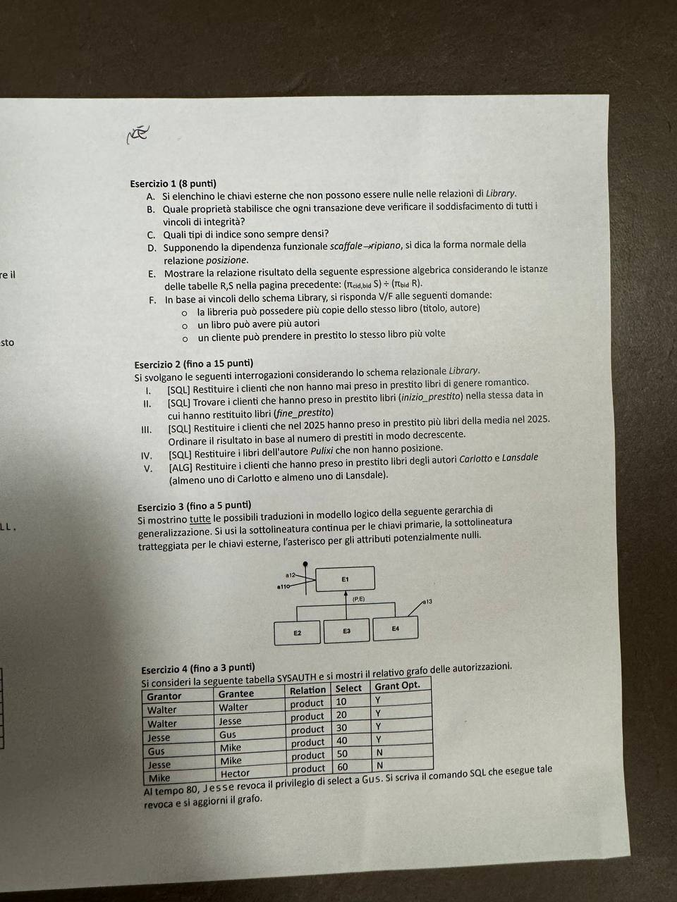

# Esame di Basi di Dati - 1 luglio 2025

> La fotografia della prima pagina non include l'intestazione con data, durata e tema. La data è ricavata dal nome della directory.

## Istruzioni

- Si usi il tema d'esame per appunti e il foglio protocollo per le risposte definitive (riportare il nominativo e la matricola anche sul foglio protocollo).
- Riportare sul foglio protocollo il riferimento all'esercizio che si sta svolgendo.
- Non usare matite e colori diversi da blu/nero.
- Consegnare sia il tema d'esame sia il foglio protocollo.
- Il compito è **insufficiente** se non si totalizzano gli 8 punti del primo esercizio. In questo caso il docente può non procedere con la correzione dei restanti esercizi.

Tutti gli esercizi fanno riferimento al seguente schema relazionale denominato `library`.

## Schema relazionale `library`

> Nel testo sorgente alcune chiavi esterne usano i nomi inglesi `book` e `client`, mentre le tabelle sono dichiarate come `libro` e `cliente`. La trascrizione conserva questa difformità.

```sql
CREATE TABLE cliente (
    cid integer PRIMARY KEY,
    nome varchar NOT NULL,
    email varchar UNIQUE NOT NULL,
    r_date date
);

CREATE TABLE libro (
    bid integer PRIMARY KEY,
    titolo varchar NOT NULL,
    autore varchar NOT NULL
);

CREATE TABLE genere (
    bid integer,
    genere varchar,
    PRIMARY KEY (bid, genere),
    FOREIGN KEY (bid)
        REFERENCES book(bid)
        ON UPDATE CASCADE
        ON DELETE CASCADE
);

CREATE TABLE posizione (
    bid integer PRIMARY KEY
        REFERENCES book(bid),
    settore char(2),
    scaffale char(2),
    ripiano char(2)
);

CREATE TABLE prestito (
    cid integer,
    bid integer,
    inizio_prestito date NOT NULL,
    fine_prestito date,
    PRIMARY KEY (cid, bid),
    FOREIGN KEY (bid)
        REFERENCES book(bid)
        ON UPDATE CASCADE
        ON DELETE CASCADE,
    FOREIGN KEY (cid)
        REFERENCES client(cid)
        ON UPDATE CASCADE
);
```

### Istanze delle relazioni

**`libro` (R)**

| bid | titolo | autore |
|---:|---|---|
| 101 | Il maestro di nodi | M. Carlotto |
| 102 | Una stagione selvaggia | J.R. Lansdale |
| 103 | Stella di mare | P. Pulixi |

**`prestito` (S)**

| cid | bid | inizio_prestito | fine_prestito |
|---:|---:|---|---|
| 101 | 101 | 2025/01/01 | 2025/01/31 |
| 101 | 103 | 2025/01/01 | 2025/01/31 |
| 102 | 103 | 2025/02/01 | 2025/03/31 |
| 103 | 102 | 2025/04/01 | 2025/05/31 |
| 103 | 103 | 2025/04/01 | 2025/05/31 |

## Esercizio 1 (8 punti)

A. Si elenchino le chiavi esterne che non possono essere nulle nelle relazioni di `Library`.

B. Quale proprietà stabilisce che ogni transazione deve verificare il soddisfacimento di tutti i vincoli di integrità?

C. Quali tipi di indice sono sempre densi?

D. Supponendo la dipendenza funzionale $scaffale \rightarrow ripiano$, si dica la forma normale della relazione `posizione`.

E. Mostrare la relazione risultato della seguente espressione algebrica considerando le istanze delle tabelle R e S nella pagina precedente:

$$
(\pi_{cid,bid} S) \div (\pi_{bid} R)
$$

F. In base ai vincoli dello schema `Library`, si risponda V/F alle seguenti domande:

- La libreria può possedere più copie dello stesso libro (titolo, autore).
- Un libro può avere più autori.
- Un cliente può prendere in prestito lo stesso libro più volte.

## Esercizio 2 (fino a 15 punti)

Si svolgano le seguenti interrogazioni considerando lo schema relazionale `Library`.

1. **[SQL]** Restituire i clienti che non hanno mai preso in prestito libri di genere romantico.
2. **[SQL]** Trovare i clienti che hanno preso in prestito libri (`inizio_prestito`) nella stessa data in cui hanno restituito libri (`fine_prestito`).
3. **[SQL]** Restituire i clienti che nel 2025 hanno preso in prestito più libri della media nel 2025. Ordinare il risultato in base al numero di prestiti in modo decrescente.
4. **[SQL]** Restituire i libri dell'autore Pulixi che non hanno posizione.
5. **[ALG]** Restituire i clienti che hanno preso in prestito libri degli autori Carlotto e Lansdale (almeno uno di Carlotto e almeno uno di Lansdale).

## Esercizio 3 (fino a 5 punti)

Si mostrino **tutte** le possibili traduzioni in modello logico della seguente gerarchia di generalizzazione. Si usi la sottolineatura continua per le chiavi primarie, la sottolineatura tratteggiata per le chiavi esterne, l'asterisco per gli attributi potenzialmente nulli.

- Super-entità `E1`, con chiave `a11` e attributo `a12`.
- Sotto-entità `E2`, `E3` ed `E4`.
- `E4` possiede inoltre l'attributo `a13`.
- La gerarchia è parziale ed esclusiva `(P, E)`.



## Esercizio 4 (fino a 3 punti)

Si consideri la seguente tabella `SYSAUTH` e si mostri il relativo grafo delle autorizzazioni.

| Grantor | Grantee | Relation | Select | Grant Opt. |
|---|---|---|---:|:---:|
| Walter | Walter | product | 10 | Y |
| Walter | Jesse | product | 20 | Y |
| Jesse | Gus | product | 30 | Y |
| Gus | Mike | product | 40 | Y |
| Jesse | Mike | product | 50 | N |
| Mike | Hector | product | 60 | N |

Al tempo 80, Jesse revoca il privilegio di `SELECT` a Gus. Si scriva il comando SQL che esegue tale revoca e si aggiorni il grafo.

